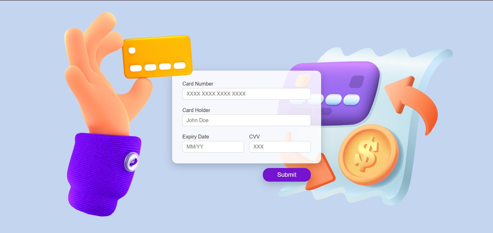

# Daily UI

## #002: Credit Card Checkout

Design a credit card checkout form or page. Don't forget the important elements such as the numbers, dates, security numbers, etc.

---
## 📸 Screenshots



## Project Structure and File Descriptions

```
index.html
README.md
images/
    card-image.png
    card-with-paper.png
    example.png
    screenshot.png
scripts/
    scripts.js
styles/
    styles.css
```

- **index.html**: The main HTML file containing the credit card payment form and layout.
- **styles/styles.css**: Contains all styles and layout rules for the project.
- **scripts/scripts.js**: Handles input formatting and validation for the form fields (card number, expiry date, CVV).
- **images/**: Folder containing images used in the form.
  - `card-image.png`: The credit card image displayed next to the form.
  - `card-with-paper.png`: Additional decorative image with paper and coins.
  - `example.png`: Example or reference image.
  - `screenshot.png`: Preview screenshot of the credit card form.
- **README.md**: Project description and documentation.

## Technologies Used

- HTML5
- CSS3 (with modern features like nested selectors)
- Vanilla JavaScript
- Form validation and input formatting
